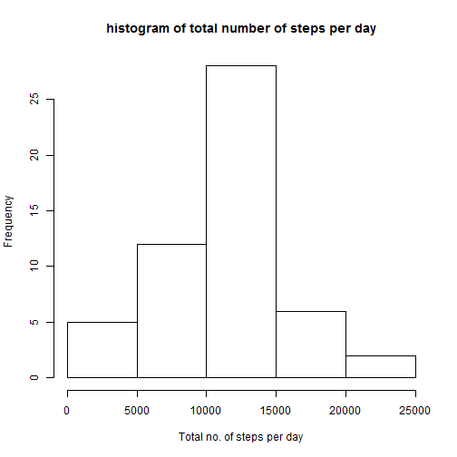
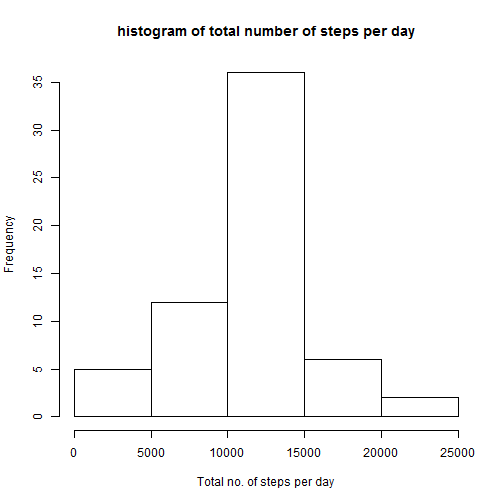
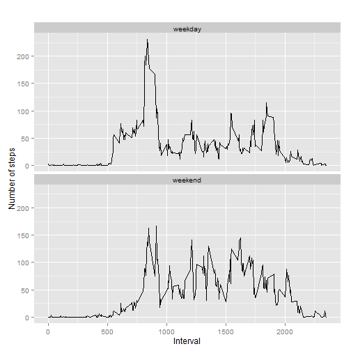

load packages

```r
library(ggplot2)
library(dplyr)
```
##Loading the data

```r
x<-read.csv("activity.csv")
#format of the date column
x$date<-as.Date(x$date,format="%Y-%m-%d")

#removing na's
y<-x[complete.cases(x),]
```

##What is mean total number of steps taken per day?

```r
by_day <- group_by(y, date)
a<-summarise(by_day,total=sum(steps))
a
```

```
## Source: local data frame [53 x 2]
## 
##          date total
## 1  2012-10-02   126
## 2  2012-10-03 11352
## 3  2012-10-04 12116
## 4  2012-10-05 13294
## 5  2012-10-06 15420
## 6  2012-10-07 11015
## 7  2012-10-09 12811
## 8  2012-10-10  9900
## 9  2012-10-11 10304
## 10 2012-10-12 17382
## ..        ...   ...
```

```r
hist(a$total,xlab="Total no. of steps per day",main="histogram of total number of steps per day")
```

 

```r
summary(a)
```

```
##       date                total      
##  Min.   :2012-10-02   Min.   :   41  
##  1st Qu.:2012-10-16   1st Qu.: 8841  
##  Median :2012-10-29   Median :10765  
##  Mean   :2012-10-30   Mean   :10766  
##  3rd Qu.:2012-11-16   3rd Qu.:13294  
##  Max.   :2012-11-29   Max.   :21194
```
**Mean of total number of steps per day is 10766, median is 10765.**
##What is the average daily activity pattern?

```r
#preprocessing data for the plot
step<-aggregate(steps ~ interval,y,mean)

#creating the plot
plot(step$interval,step$steps,type='l',main="Average number of steps over all days", xlab="Interval", ylab="Average number of steps")
```

 

```r
#row with max steps
max_step<-which.max(step$steps)
#interval with this max steps
step[max_step,]
```

```
##     interval    steps
## 104      835 206.1698
```
**The interval 835 has the maximum average value of steps (206.1698)**

##Imputing missing values

```r
sum(is.na(x))
```

```
## [1] 2304
```

```r
#number of rows with NA???s is 2304

#I picked the strategy of replacing NA???s with the mean for that 5-minute interval.
data_imputed <- x
for (i in 1:nrow(data_imputed)) {
    if (is.na(data_imputed$steps[i])) {
        interval_value <- data_imputed$interval[i]
        steps_value <- step[step$interval == interval_value,]
        data_imputed$steps[i] <- steps_value$steps
    }
}
```
** All NA???s are replaced with mean of 5-minute interval.**

```r
# calculate  total number of steps taken each day
byday1<-group_by(data_imputed,date)
new1<-summarise(byday1,total=sum(steps))
hist(new1$total,xlab="Total no. of steps per day",main="histogram of total number of steps per day")
```

 

```r
# get mean and median of imputed data without NA
mean(new1$total)
```

```
## [1] 10766.19
```

```r
median(new1$total)
```

```
## [1] 10766.19
```

```r
#get mean and median of given data with na
mean(a$total)
```

```
## [1] 10766.19
```

```r
median(a$total)
```

```
## [1] 10765
```
**Mean values stays the same but therer is slight difference in median value**

##Are there differences in activity patterns between weekdays and weekends?

```r
data_imputed['type_of_day']<-weekdays(as.Date(data_imputed$date))
data_imputed$type_of_day[data_imputed$type_of_day %in% c('Saturday','Sunday')]<-"weekend"
data_imputed$type_of_day[data_imputed$type_of_day !="weekend"]<-"weekday"
data_imputed$type_of_day <- as.factor(data_imputed$type_of_day)
df_imputed_steps_by_interval <- aggregate(steps ~ interval + type_of_day, data_imputed, mean)
#create a plot
qplot(interval,steps,data = df_imputed_steps_by_interval,type = 'l',geom=c("line"),
      xlab = "Interval", ylab = "Number of steps",main = "") +
    facet_wrap(~ type_of_day, ncol = 1)
```

 
